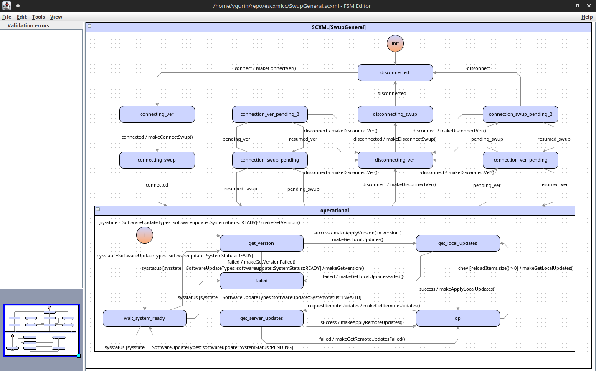

escxmlcc
========

This editor and generator provide Mealy-Moore hierarchical state machine function, in particular:
  - init, state and group state nodes (plain and hierarchical FSM)
  - state handlers
  - conditions
  - data model with accessors and ability to use it in the conditions
  - triggers
  - multiple transition handlers
  - self-transitions
  - auto-transitions
  - ability to put any code to the generated source code (includes, types, etc.)
Generated code  has no dependency on other libraries and is self-sufficient.
Project is on the proof-of-concept stage.

The example of the FSM graph is provided on the picture below:


##### License

This Source Code Form is subject to the terms of the GPLv3.
The generated code is covered by MIT License.

##### Build Instructions for Linux
###### Dependencies

- A C++11 enabled compiler is needed
- escxmlcc uses CMake as buildsystem
- escxmlcc uses Boost >= 1.45.0

###### Compilation

For compilation call:

```bash
mkdir build
cd build
cmake ..
make
optional: sudo make install
```

To compile with unit tests:
```bash
mkdir build
cd build
cmake -DWITH_TESTS=TRUE ..
make
```

To specify a installation directory (like `--prefix=` if you're used to autotools) call cmake like:
```bash
cmake -DCMAKE_INSTALL_PREFIX:PATH=$YOUR_PATH ..
make
make install
```
